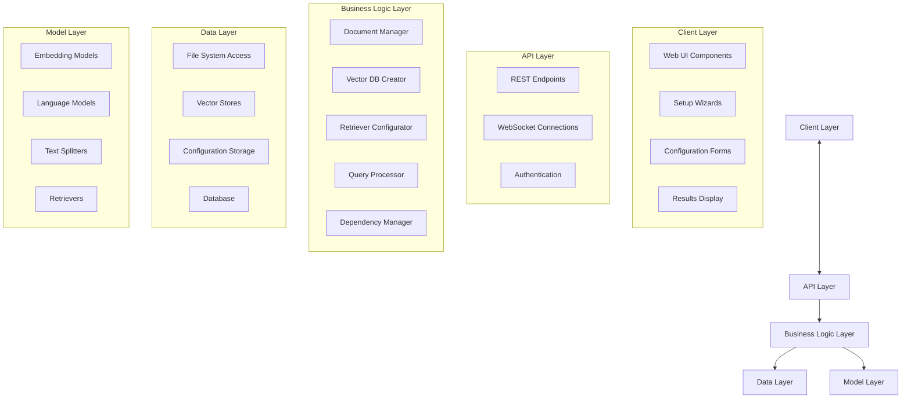

# Design Document: Easy RAG System

## Overview

The Easy RAG System is designed to provide a user-friendly interface for non-technical users to create and use Retrieval-Augmented Generation (RAG) systems. The application will follow a modular architecture with a clear separation of concerns between the user interface, document processing, vector database management, and language model integration.

The system will be built as a web application with an intuitive browser-based interface that guides users through the process of document management, vector database creation, retrieval configuration, and query interaction. The application will handle dependencies automatically and provide clear feedback throughout all operations.

## Architecture

The Easy RAG System will follow a modern web application architecture with the following components:



### Key Components:

1. **Client Layer**: Browser-based user interface with responsive design
2. **API Layer**: RESTful and WebSocket endpoints for client-server communication
3. **Business Logic Layer**: Implements the core functionality of the system
4. **Data Layer**: Manages data persistence and retrieval
5. **Model Layer**: Integrates with various AI models and algorithms

## Components and Interfaces

### 1. User Interface Components

#### Main Web Application Interface
- Responsive navigation menu for accessing different modules
- Status notifications for displaying system information
- Main content area for displaying module-specific interfaces
- User authentication and profile management

#### Document Management Interface
- Document list view with metadata columns and sorting capabilities
- Drag-and-drop file upload functionality
- Document preview panel with content visualization
- Folder structure navigation with breadcrumbs

#### Vector Database Creation Wizard
- Step-by-step web interface for creating vector databases
- Document loader selection with information tooltips
- Text splitting configuration with visual chunk representation
- Embedding model selection with performance metrics
- Vector store selection with comparison information
- Real-time progress indicators and status updates

#### Retriever Configuration Interface
- Retriever type selection with visual comparison
- Dynamic configuration options for each retriever type
- Reranking options with performance metrics
- Number of chunks configuration with visual representation
- Interactive parameter tuning

#### Query Interface
- LLM selection dropdown with model information
- Query input field with history and suggestions
- Response display area with formatting options
- Retrieved context display with source highlighting
- Configuration panel for adjusting settings
- Session history and saved queries

### 2. Business Logic Components

#### Document Manager
```python
class DocumentManager:
    def add_document(self, file_path: str) -> bool
    def remove_document(self, document_id: str) -> bool
    def get_document_metadata(self, document_id: str) -> Dict
    def list_documents() -> List[Dict]
    def validate_document_format(self, file_path: str) -> bool
```

#### Vector Database Creator
```python
class VectorDatabaseCreator:
    def create_vector_db(self, 
                         documents: List[str], 
                         folder_path: Optional[str],
                         loader_types: List[str],
                         text_splitter: TextSplitter,
                         embedding_model: EmbeddingModel,
                         vector_store: VectorStore) -> str
    def get_creation_progress() -> float
    def get_available_loaders() -> List[str]
    def get_required_loaders_for_extensions(self, extensions: List[str]) -> List[str]
    def install_dependencies(self, loader_type: str) -> bool
```

#### Text Splitter Configurator
```python
class TextSplitterConfigurator:
    def get_available_splitters() -> List[str]
    def create_splitter(self, splitter_type: str, chunk_size: int, chunk_overlap: int) -> TextSplitter
    def validate_parameters(self, splitter_type: str, chunk_size: int, chunk_overlap: int) -> bool
    def get_default_parameters(self, splitter_type: str) -> Dict
```

#### Embedding Model Manager
```python
class EmbeddingModelManager:
    def get_available_models() -> List[str]
    def check_api_keys(self, model_name: str) -> bool
    def download_model(self, model_name: str) -> bool
    def get_model(self, model_name: str) -> EmbeddingModel
```

#### Vector Store Manager
```python
class VectorStoreManager:
    def get_available_stores() -> List[str]
    def create_store(self, store_type: str, path: str) -> VectorStore
    def load_store(self, store_path: str) -> VectorStore
```

#### Retriever Configurator
```python
class RetrieverConfigurator:
    def get_available_retrievers() -> List[str]
    def create_retriever(self, retriever_type: str, vector_store: VectorStore, config: Dict) -> Retriever
    def get_configuration_options(self, retriever_type: str) -> Dict
```

#### LLM Manager
```python
class LLMManager:
    def get_available_models() -> List[str]
    def check_api_keys(self, model_name: str) -> bool
    def download_model(self, model_name: str) -> bool
    def get_model(self, model_name: str) -> LLM
```

#### Query Processor
```python
class QueryProcessor:
    def process_query(self, query: str, retriever: Retriever, llm: LLM) -> Dict
    def get_retrieved_context(self) -> List[Dict]
```

#### Dependency Manager
```python
class DependencyManager:
    def check_core_dependencies() -> bool
    def install_core_dependencies() -> bool
    def check_feature_dependencies(self, feature: str) -> bool
    def install_feature_dependencies(self, feature: str) -> bool
    def generate_requirements_file(self, path: str) -> bool
```

### 3. Data Layer Components

#### File System Access
```python
class FileSystemAccess:
    def read_file(self, file_path: str) -> bytes
    def write_file(self, file_path: str, content: bytes) -> bool
    def list_directory(self, directory_path: str) -> List[str]
    def get_file_metadata(self, file_path: str) -> Dict
```

#### Configuration Storage
```python
class ConfigurationStorage:
    def save_configuration(self, config_name: str, config_data: Dict) -> bool
    def load_configuration(self, config_name: str) -> Dict
    def list_configurations() -> List[str]
    def delete_configuration(self, config_name: str) -> bool
```

#### Vector Database Storage
```python
class VectorDatabaseStorage:
    def save_metadata(self, db_id: str, metadata: Dict) -> bool
    def load_metadata(self, db_id: str) -> Dict
    def list_databases() -> List[str]
    def delete_database(self, db_id: str) -> bool
```

### 4. Model Layer Components

#### Text Splitter Interface
```python
class TextSplitter:
    def split_text(self, text: str) -> List[str]
    def get_parameters() -> Dict
```

#### Embedding Model Interface
```python
class EmbeddingModel:
    def embed_documents(self, documents: List[str]) -> List[List[float]]
    def embed_query(self, query: str) -> List[float]
    def get_dimension() -> int
```

#### Vector Store Interface
```python
class VectorStore:
    def add_documents(self, documents: List[str], embeddings: List[List[float]]) -> bool
    def similarity_search(self, query_embedding: List[float], k: int) -> List[Dict]
    def save(self, path: str) -> bool
    def load(self, path: str) -> bool
```

#### Retriever Interface
```python
class Retriever:
    def retrieve(self, query: str, k: int) -> List[Dict]
    def get_configuration() -> Dict
```

#### LLM Interface
```python
class LLM:
    def generate(self, prompt: str, context: List[str]) -> str
    def get_parameters() -> Dict
```

## Data Models

### Document Model
```python
class Document:
    id: str  # Unique identifier
    path: str  # File path
    name: str  # File name
    type: str  # File type/extension
    size: int  # File size in bytes
    last_modified: datetime  # Last modification date
    content: Optional[str]  # Document content (loaded on demand)
    metadata: Dict  # Additional metadata
```

### Vector Database Model
```python
class VectorDatabase:
    id: str  # Unique identifier
    name: str  # User-friendly name
    path: str  # Storage path
    created_at: datetime  # Creation date
    document_ids: List[str]  # IDs of documents included
    embedding_model: str  # Name of embedding model used
    vector_store_type: str  # Type of vector store
    text_splitter: Dict  # Text splitter configuration
    chunk_count: int  # Number of chunks in the database
    metadata: Dict  # Additional metadata
```

### Configuration Model
```python
class Configuration:
    id: str  # Unique identifier
    name: str  # User-friendly name
    created_at: datetime  # Creation date
    updated_at: datetime  # Last update date
    settings: Dict  # Configuration settings
```

### Query Result Model
```python
class QueryResult:
    query: str  # Original query
    response: str  # Generated response
    contexts: List[Dict]  # Retrieved contexts
    llm_used: str  # LLM used for generation
    retriever_used: str  # Retriever used
    timestamp: datetime  # Query time
```

## Error Handling

The system will implement a comprehensive error handling strategy to provide user-friendly feedback and recovery options:

### Error Categories

1. **User Input Errors**
   - Invalid file formats
   - Invalid configuration parameters
   - Missing required inputs

2. **System Errors**
   - Dependency installation failures
   - File system access issues
   - Network connectivity problems

3. **Model Errors**
   - API key validation failures
   - Model download failures
   - Model execution errors

### Error Handling Strategy

1. **Validation Layer**
   - Input validation before processing
   - Parameter range checking
   - File format validation

2. **Error Recovery**
   - Automatic retry mechanisms for transient errors
   - Fallback options for model failures
   - Clear instructions for user-resolvable issues

3. **User Feedback**
   - User-friendly error messages
   - Suggested actions for resolution
   - Progress indicators for long-running operations

### Error Logging

The system will maintain detailed logs of errors for troubleshooting:

```python
class ErrorLogger:
    def log_error(self, error_type: str, message: str, details: Dict) -> None
    def get_recent_errors(self, count: int) -> List[Dict]
    def clear_logs() -> None
```

## Testing Strategy

The Easy RAG System will be tested at multiple levels to ensure reliability and usability:

### Unit Testing

- Test individual components in isolation
- Mock dependencies for controlled testing
- Cover edge cases and error conditions

### Integration Testing

- Test interactions between components
- Verify data flow between layers
- Test dependency management

### System Testing

- End-to-end testing of complete workflows
- Performance testing with various document sizes
- Compatibility testing across operating systems

### Usability Testing

- Test with representative users
- Evaluate interface clarity and ease of use
- Gather feedback on error messages and guidance

### Test Automation

- Automated unit and integration tests
- Regression test suite for feature additions

## Implementation Considerations

### Technology Stack

- **Frontend**: Flask with Bootstrap for simple, responsive web interface
- **Backend**: Python with Flask and LangChain for RAG components
- **Database**: SQLite for lightweight local data storage
- **Vector Stores**: Support for Chroma, FAISS, and Pinecone
- **Embedding Models**: Integration with Hugging Face and OpenAI models
- **LLMs**: Support for local models via Hugging Face and API-based models
- **Server-Sent Events**: For progress updates and notifications

### Performance Optimization

- Asynchronous processing for long-running tasks
- Local caching of embeddings and query results
- Background tasks for document processing
- Pagination for large document collections
- Progress indicators for user feedback

### Security Considerations

- Local storage of API keys in .env file
- Basic authentication for multi-user setup (optional)
- Secure handling of user documents
- Clear documentation on data handling

### Extensibility

- Modular architecture for additional document loaders
- Configuration system for adding new models
- Extensible retriever framework
- Custom prompt templates

## Local Development and Testing

- Simple setup with minimal dependencies
- Local development server
- Documentation and tutorials
- Focus on MVP functionality for testing core features
- Easy installation process for local testing